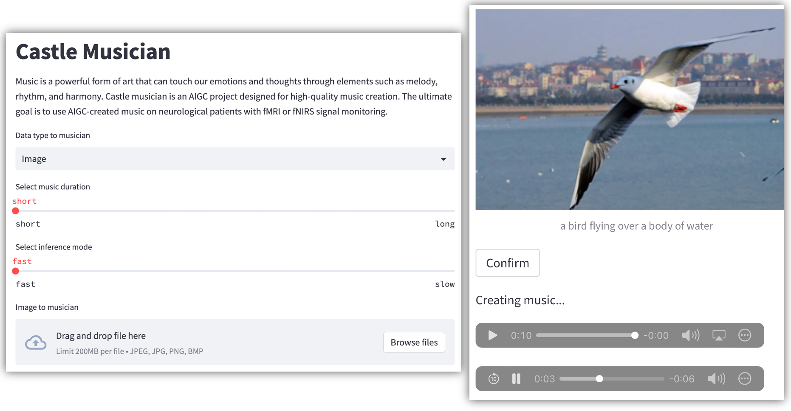

# Castle Musician
Castle musician is an AIGC musician project designed for high-quality music generation. The ultimate goal is to use AIGC-created music on patients with fMRI or fNIRS signal monitoring.

Pipeline:

1. OFA for image caption
2. AudioLDM2 for caption-to-music generation



### Startup

`streamlit run app.py`


### Requirements

- Pydub for audio handling: `pip install pydub` and `sudo install ffmpeg`

- AudioLDM for audio generation: `pip install audioldm2`

- Huggingface Transformers for image captioning: `pip install transformers sentencepiece open_clip_torch fairseq`

- Modelscope for image captioning: `pip install opencv-python timm zhconv unicodedata2 rapidfuzz modelscope -i https://pypi.tuna.tsinghua.edu.cn/simple `

- StreamLit for web app: `pip install streamlit`

- AudioLDM cuda env: 
```
pip install torch==1.12.1+cu113 torchvision==0.13.1+cu113 torchaudio==0.12.1 --extra-index-url https://download.pytorch.org/whl/cu113 -i https://pypi.tuna.tsinghua.edu.cn/simple some-package

pip install jupyter tqdm soundfile progressbar einops scipy librosa librosa==0.9.2 torchlibrosa transformers ftfy pandas -i https://pypi.tuna.tsinghua.edu.cn/simple some-package
```

- new image model
```
pip install opencv-python timm unicodedata2 zhconv decord>=0.6.0 rapidfuzz			
```

​		install `eva-decord` instead of `decord ` on MacOS M1/2

- audio noise reduce function

```
pip install scipy wave noisereduce -i https://pypi.tuna.tsinghua.edu.cn/simple some-package
```


